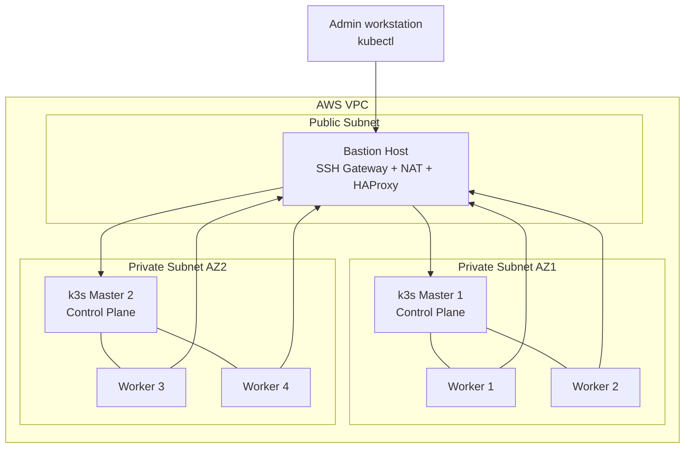
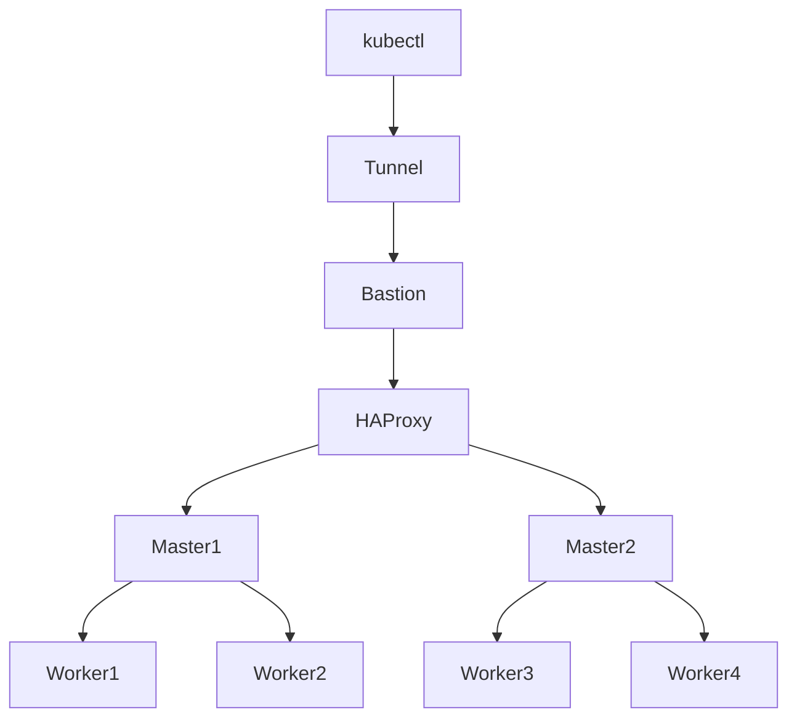
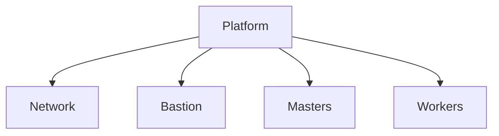
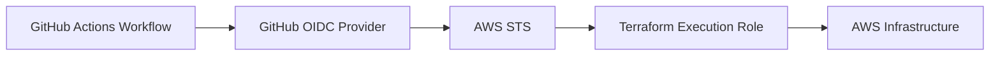
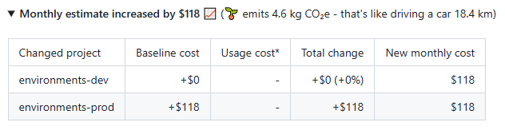
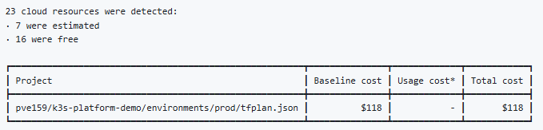

# k3s-platform-demo


# DevOps Concepts Demonstrated

This project demonstrates how to build and automate a small Kubernetes platform using modern DevOps and Platform Engineering practices.

Key concepts illustrated in this repository include:

- Infrastructure as Code using Terraform modules
- Modular infrastructure design
- Multi-environment infrastructure management
- Infrastructure CI/CD pipelines with GitHub Actions
- Secure cloud authentication using GitHub OIDC
- Cost-aware infrastructure management (FinOps) with Infracost
- Infrastructure drift detection
- Private Kubernetes cluster networking
- Kubernetes control-plane high availability

---

# Architecture Overview

The platform deploys a high-availability **k3s Kubernetes cluster on AWS**.

Infrastructure components:

- VPC networking
- Public subnet for bastion host
- Private subnets across two availability zones
- Bastion host providing:
  - SSH access to the cluster
  - NAT for outbound traffic
  - HAProxy load balancing for the Kubernetes API
- 2 Kubernetes control-plane nodes
- 4 worker nodes

---

# AWS Network Architecture



### Architecture highlights

- Only the **bastion host has a public IP**
- Kubernetes nodes run in **private subnets**
- The bastion acts as **SSH gateway, NAT instance, and Kubernetes API load balancer (HAProxy)**
- The **Kubernetes API is load balanced across the control-plane nodes**

### Traffic flow

- kubectl access: Admin workstation → Bastion → HAProxy → Masters
- Worker API calls: Workers → HAProxy → Masters
- Cluster communication: Masters ↔ Workers

---

# Kubernetes Cluster Architecture



Cluster characteristics:

- Kubernetes distribution: **k3s**
- Container runtime: **containerd**
- Operating system: **Ubuntu 24.04**
- **2 control-plane nodes**
- **4 worker nodes** across two availability zones

Workers communicate with the Kubernetes API through **HAProxy running on the bastion host**.

---

# Technology Stack

| Category | Technology |
|---|---|
| Infrastructure as Code | Terraform |
| Cloud Provider | AWS |
| Kubernetes Distribution | k3s |
| Container Runtime | containerd |
| CI/CD | GitHub Actions |
| Security | AWS OIDC |
| Cost Estimation | Infracost |
| Static Analysis | TFLint |
| Load Balancing | HAProxy |
| Operating System | Ubuntu 24.04 |

---

# Terraform Architecture

Terraform modules are composed into a **platform module** orchestrating the infrastructure.



Repository:

```
bootstrap/
environments/
 ├ dev
 ├ prod
modules/
 ├ network
 ├ bastion
 ├ k3s-masters
 ├ k3s-workers
 └ platform
```

Each module manages a specific infrastructure component.

---

# Bootstrap Infrastructure

Before deploying the platform, a **bootstrap Terraform stack** prepares the AWS environment.

This bootstrap layer creates:

- The **S3 bucket used for the Terraform remote state**
- Versioning and encryption for the state bucket
- The **GitHub OIDC provider**
- The **Terraform execution IAM role**
- IAM policies required for infrastructure provisioning

This ensures Terraform runs with **secure, temporary credentials** and a properly configured backend.

---

# AWS Authentication (OIDC + AssumeRole)

Terraform is executed from **GitHub Actions using AWS OIDC authentication**.

Instead of storing AWS credentials in GitHub, the workflow:

1. Authenticates with AWS using the **GitHub OIDC provider**
2. Calls **AWS STS AssumeRoleWithWebIdentity**
3. Obtains temporary credentials for the **Terraform execution role**



Advantages of this approach:

- No long-lived AWS credentials
- Short-lived security tokens
- Fine-grained IAM permissions
- Secure CI/CD authentication

---

# CI/CD Pipeline

Infrastructure provisioning and updates are automated using **GitHub Actions**.

Pipeline features:

- Terraform formatting validation
- Terraform configuration validation
- Static analysis with **TFLint**
- Terraform plan on Pull Requests
- Cost estimation with **Infracost**
- Manual apply using workflow dispatch
- Environment protection rules
- Drift detection workflow
- Controlled destroy workflow

---

# Deployment Strategy

| Environment | Apply Strategy |
|---|---|
| dev | Automatic apply via GitHub Actions |
| prod | Manual approval required via GitHub Environment protection |

---

# FinOps: Cost Visibility with Infracost

The CI pipeline integrates **Infracost** to estimate infrastructure costs directly in Pull Requests.

Example output from a Pull Request summary:





Pull Requests display:

- Estimated monthly infrastructure cost
- Cost differences introduced by the change (if applicable)

This helps maintain **cost-aware infrastructure decisions**.

---

# Security Design

Security measures implemented:

- OIDC authentication for GitHub Actions
- Terraform execution using AssumeRole
- No long-lived AWS credentials stored in GitHub
- Kubernetes nodes deployed in private subnets
- Bastion host as the only public entry point
- Security group isolation
- Encrypted Terraform state
- S3 public access blocked

---

# Trade-offs and Design Choices

Several architectural decisions were made to balance cost, complexity, and educational value.

Key choices include:

- Using **k3s instead of EKS** to reduce infrastructure cost
- Using a **NAT instance instead of a managed NAT Gateway**
- Running **HAProxy on the bastion host** instead of a managed load balancer

---

# Accessing the Kubernetes Cluster

Retrieve the kubeconfig from the first master:

ssh -J ubuntu@<bastion-ip> ubuntu@<master-ip> "sudo cat /etc/rancher/k3s/k3s.yaml"

Create the API tunnel:

ssh -N -L 6443:127.0.0.1:6443 -J ubuntu@<bastion-ip> ubuntu@<master-ip>

Use kubectl locally:

kubectl get nodes

---

# Drift Detection

A scheduled GitHub workflow runs:

terraform plan

to detect configuration drift.

---

# Destroy Workflow

A dedicated workflow allows safe destruction of the **dev environment**.

The workflow requires explicit confirmation:

DESTROY

---

# Future Improvements

Possible extensions for the platform:

- Prometheus monitoring
- Grafana dashboards
- GitOps with ArgoCD
- Secrets management with Vault
- Example application deployment
- Cluster autoscaling
